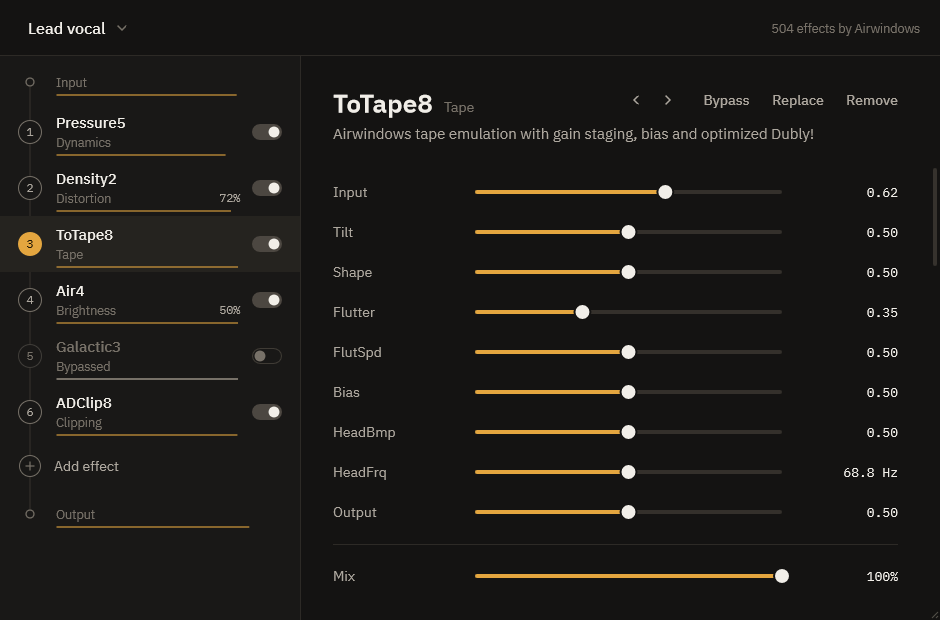
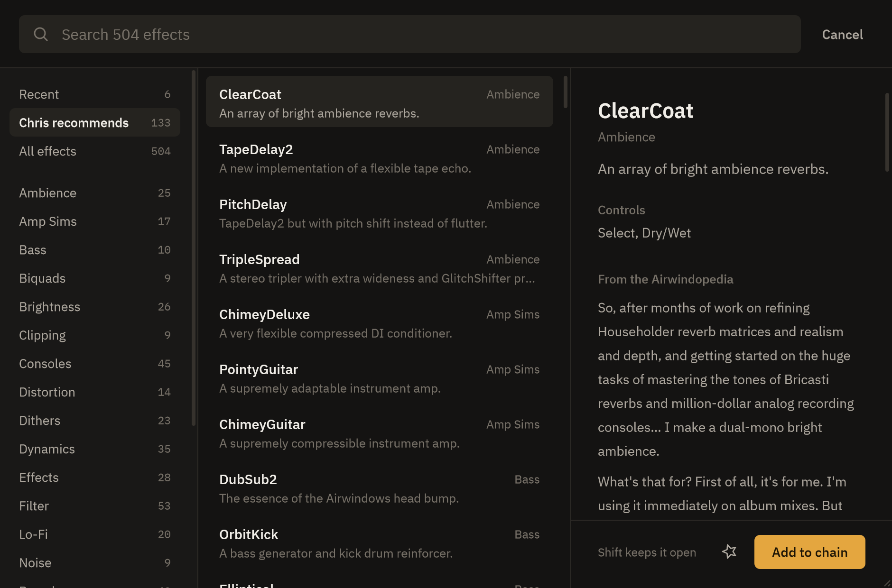
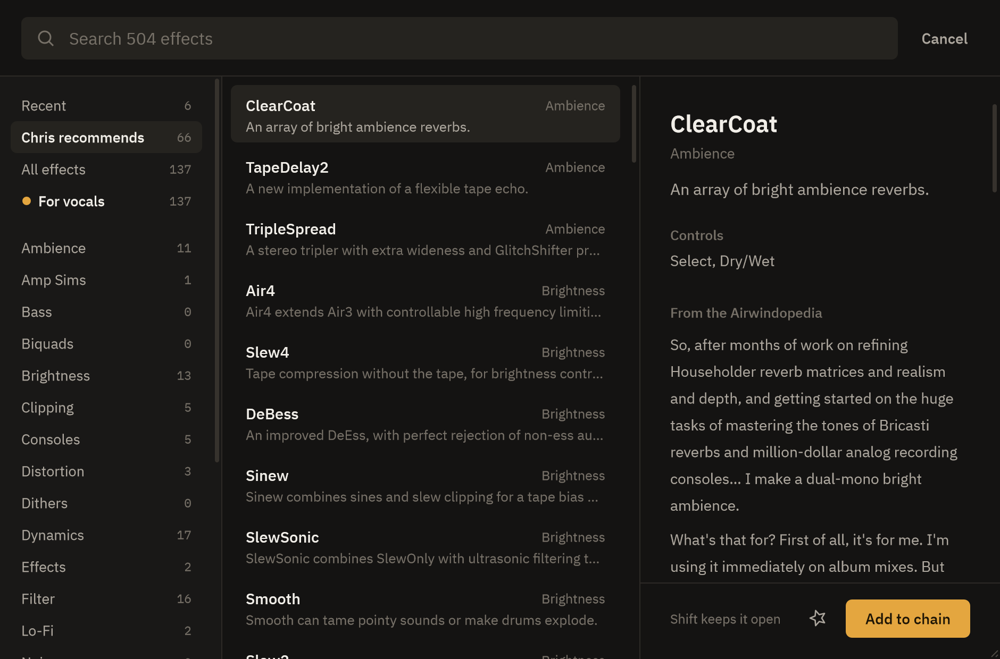
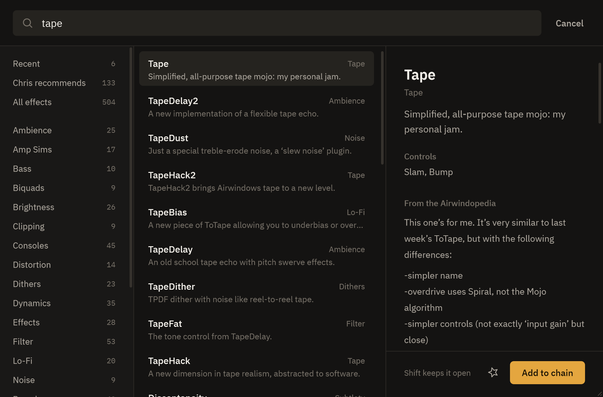
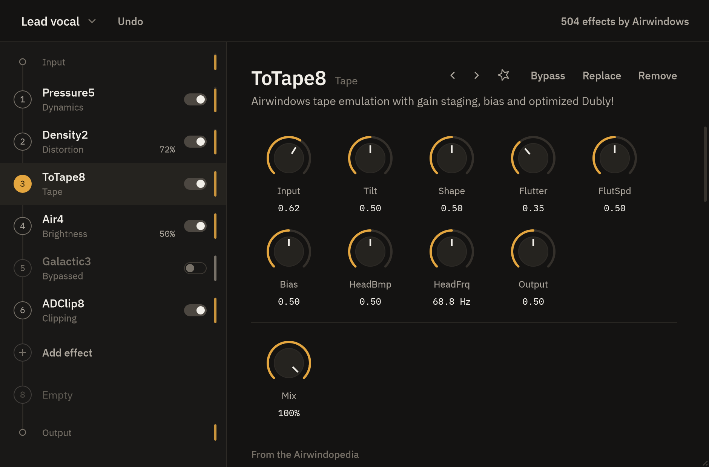
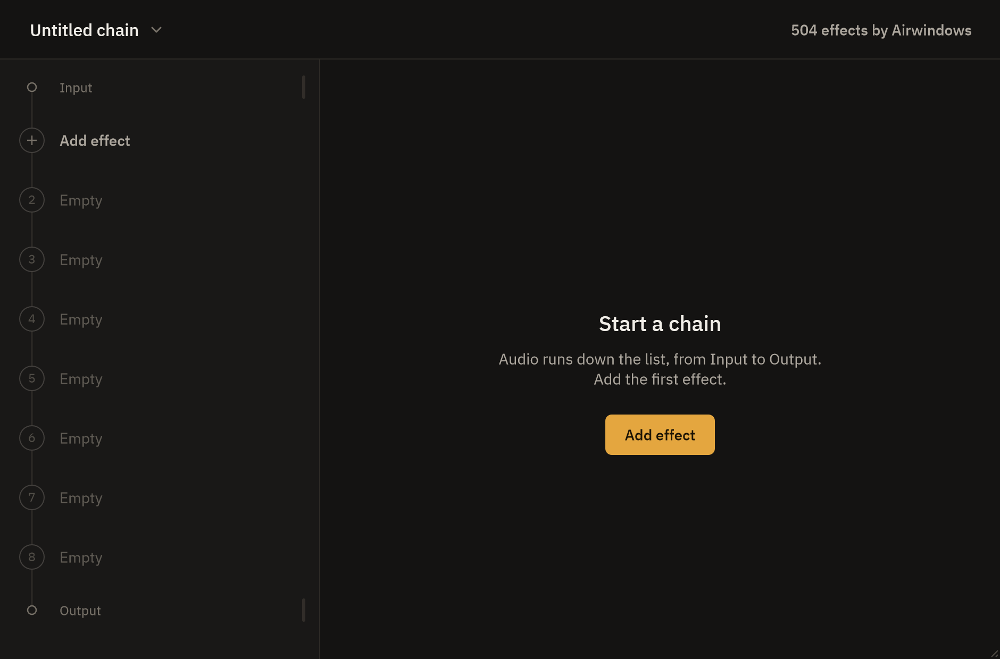
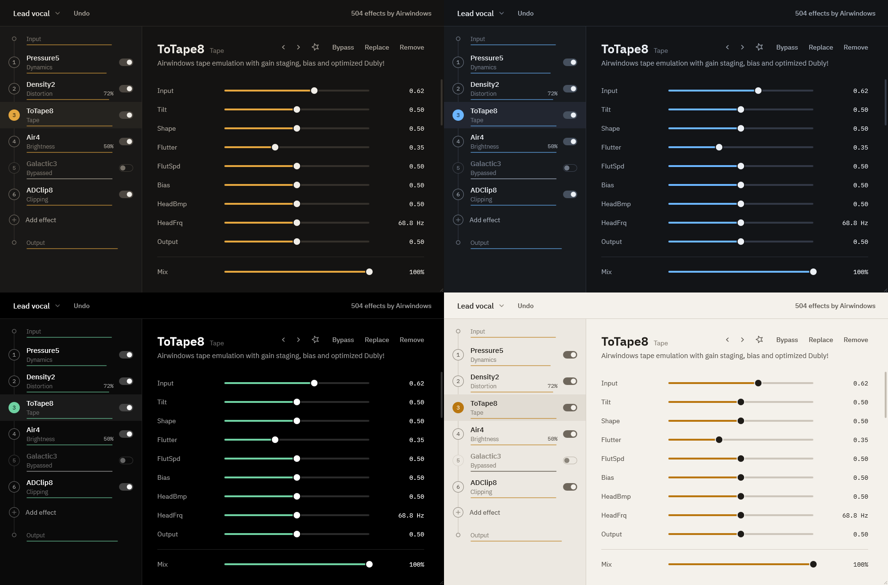

# Airwindows Chain

Up to sixteen Airwindows effects in one plugin, in any order. Every effect in
[Airwindows Consolidated](https://www.airwindows.com/consolidated/) is available,
with Chris Johnson's description of each one next to its controls.

Consolidated runs one effect per instance. This runs a chain.

## Download

Windows, 64-bit: [latest release](https://github.com/clotheshoesandwoes/airwindows-chain/releases/latest).

- `AirwindowsChain-<version>-setup.exe` installs the VST3 and CLAP where every
  DAW looks, and adds an uninstaller.
- `AirwindowsChain-<version>-windows.zip` if you'd rather copy the files
  yourself: the `.vst3` folder goes in `C:\Program Files\Common Files\VST3`,
  the `.clap` in `C:\Program Files\Common Files\CLAP`.

Then rescan plugins in your DAW once. It is listed under Kani.

## Build it yourself

```
toolsuild.bat
tools\install.bat
```

`build.bat` needs Visual Studio 2022 with the C++ workload (it finds it through
vswhere; CMake and Ninja come with it). The first build compiles all 504
effects and takes a few minutes. `install.bat` copies the result into the
plugin folders; Windows asks for admin rights. `tools\package.py` makes the
zip and the installer (the installer needs NSIS).

## Using it

| Where | What |
|---|---|
| Chain list | Eight slots on show, more as they fill, up to sixteen. Click an empty one to add. Click to select. Drag to reorder. The switch bypasses. Double-click to replace. |
| Add effect | Opens the browser. Type to search names, categories and descriptions. Hover to read, click or Enter to add. Esc closes. |
| Effect panel | Drag a control, or click a fader's track to jump. Hold Ctrl or Shift while dragging for ten times finer moves. Double-click a control to reset it, or its value to type one. The arrows step through the effect's category. |
| Type to search | With the mouse over the window, type a letter and the browser opens with it. Keys the plugin doesn't use go to the host. Can be turned off in the chain menu. |
| Knobs | "Knobs instead of faders" in the chain menu lays the controls out as a grid of knobs. Drag up or right to raise. |
| Mix | Blends each effect with what went into it. |
| Chain name | Save and open chains. They are small files in `Documents\Airwindows Chain`. Also holds Undo, the theme and accent choices, and About. |
| Undo | Next to the chain name after any edit. Covers add, remove, replace, move, duplicate, clear and open, forty steps deep. |
| Star | Marks a favourite. Favourites get their own list in the browser, first in line. |
| For vocals | A switch under All effects in the browser. On, every list, the categories and search included, shows only the effects that suit a voice: compressors and gates, de-essers, air, channel strips, tape, plates and rooms, doublers. The list is mine, not Chris's, and lives in `src/VocalList.h`. |
| Right-click a row | Replace, duplicate, add an effect after this one, bypass, move, remove. |
| Meters | The small meter at the right edge of each effect is the level after it, from -60 dB to full scale. Red means it went over. Input and Output have one too. |
| Theme | Warm, Cool, Black or Light, with an amber, coral, mint, sky, lilac or plain accent. Remembered for every instance. |

The host sees sixteen fixed blocks of parameters, named after whatever sits in
each slot ("2. Density2: Drive"). Automation follows an effect when you reorder
the chain.

## How it works

- `src/Catalog.*`: every effect in the registry, the search, and the docs.
- `src/ChainProcessor.*`: the chain. The message thread owns the model. The audio
  thread owns its own effect instances and hears about changes through a
  lock-free queue. Replaced instances go back through a second queue and are freed
  on the message thread, so nothing is allocated or freed while audio runs.
  Swapping, bypassing and removing fade over 20 ms.
- `src/ChainEditor.cpp`, `src/ui/`: the interface. IBM Plex, drawn by hand, no
  images.

## Tests

`build\awchain_harness_artefacts\Release\awchain_harness.exe` runs everything
headless:

| Command | Checks |
|---|---|
| `test` | The chain against the same effects run directly (bit-exact, including mix, bypass, reorder, 44.1/48/96 kHz, odd block sizes, mono). Editing, state and chain files. Four seconds of random edits against a running audio thread. All 504 effects, at defaults and with every control at maximum. |
| `vst3 <path to .vst3>` | Loads the built plugin the way a DAW does: passthrough when empty, project state restore, processing, state save. |
| `snap <folder>` | Renders the editor to PNGs: main view, small and large windows, browser, search, empty and full chains, every theme, About. |

## Screenshots

The chain and the selected effect, with Chris's notes underneath:



The browser: Chris's recommended list, every category, and the write-up for whatever you hover:



The For vocals switch on: the same lists, narrowed to what suits a voice:



Searching:



Knobs, if you prefer them:



A new instance, eight slots ready:



Warm, Cool, Black and Light, each with six accents:



## Licence

The code in this repository is MIT: use it however you like. The effects
(Airwindows, Chris Johnson) and the registry that packages them (airwin2rack,
BaconPaul and the Surge Synth Team) are MIT as well.

The built plugin also contains JUCE and the VST3 SDK, which are GPLv3 for
open-source projects. So the plugin you build or download is GPLv3: free to use
and pass on, and anyone who ships it has to share the source too.

Fonts: IBM Plex Sans and Mono, SIL Open Font License (`resources/fonts/OFL.txt`).
CLAP support: clap-juce-extensions, MIT.
